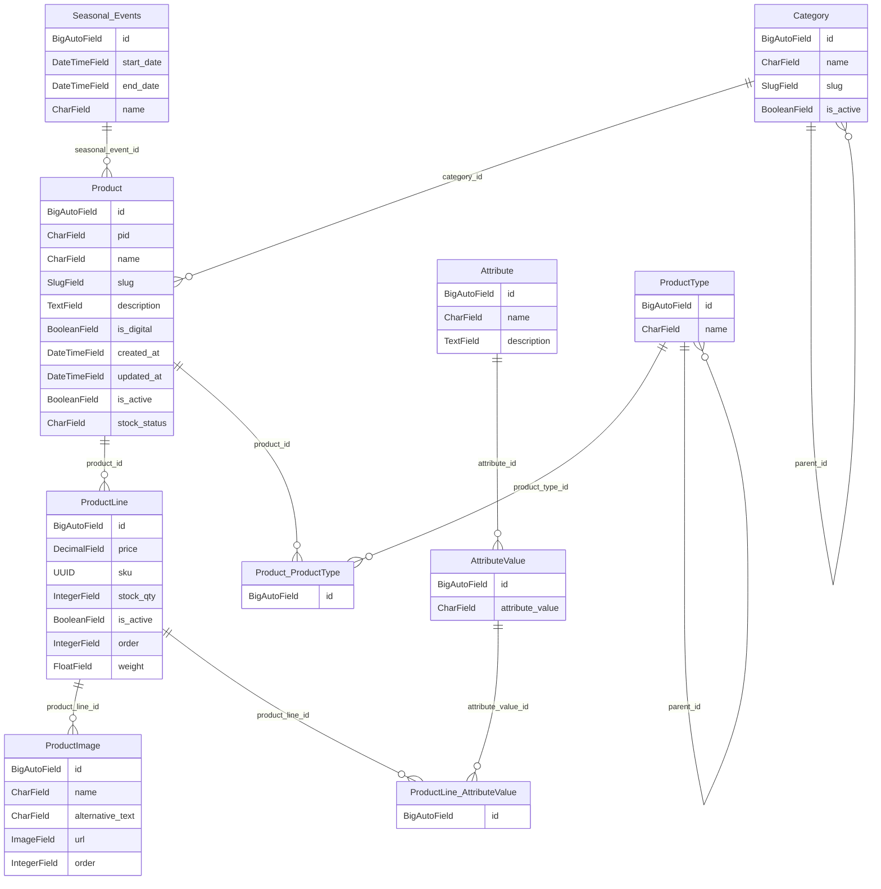

<div align="center">
<h1>Django Database ORM</h1>
</div>

## Context

- [Context](#context)
  - [Preparation](#preparation)
  - [Django Model](#django-model)
    - [Model Structure](#model-structure)
    - [Building Multiple Models](#building-multiple-models)
    - [DateTimeField Options](#datetimefield-options)
    - [Choices Field](#choices-field)
    - [Required, Null, Blank and Default](#required-null-blank-and-default)
    - [Custom Primary Key](#custom-primary-key)
    - [Making a Relationship](#making-a-relationship)

### Preparation

- Create project
  - `django-admin startproject orm_project`
- Create app
  - `cd orm_project`
  - `py manage.py startapp orm_app`
- Add app in `INSTALLED_APPS`

    ```py
    INSTALLED_APPS = [
        ...
        'orm_app',
    ]
    ```

[⬆️ Go to Context](#context)

### Django Model

#### Model Structure



[⬆️ Go to Context](#context)

#### Building Multiple Models

- [Django Model Field Reference](https://docs.djangoproject.com/en/5.1/ref/models/fields/)
- Open `models.py` in app directory and create model

  ```py
  from django.db import models
  import uuid

  # Create your models here.
  class product_model(models.Model):
      pid=models.CharField(max_length=255)
      name=models.CharField(max_length=100)
      slug=models.SlugField()
      description=models.TextField()
      is_digital=models.BooleanField()
      created_at=models.DateTimeField()
      is_active=models.BooleanField()

  class product_line_model(models.Model):
      price=models.DecimalField()
      sku=models.UUIDField(default=uuid.uuid4)
      stock_qty=models.IntegerField()
      is_active=models.BooleanField()
      order=models.IntegerField()
      weight=models.FloatField()

  class product_image_model(models.Model):
      name=models.CharField(max_length=100)
      alternative_text=models.CharField(max_length=100)
      url=models.ImageField()
      order=models.IntegerField()

  class category_model(models.Model):
      name=models.CharField(max_length=100)
      slug=models.SlugField()
      is_active=models.BooleanField()

  class seasonal_event_model(models.Model):
      start_date=models.DateTimeField()
      end_date=models.DateTimeField()
      name=models.CharField(max_length=100)
  ```

[⬆️ Go to Context](#context)

#### DateTimeField Options

- In created `auto_now_add` is used
- In updated `auto_now` is used

  ```py
  class product_model(models.Model):
      ...
      created_at=models.DateTimeField(auto_now_add=True,editable=False)
      updated_at=models.DateTimeField(auto_now=True,editable=False)
      ...
  ```

  - `editable=False` is used to prevent appearing in form

[⬆️ Go to Context](#context)

#### Choices Field

- Limiting a valid value that a particular field can have

  ```py
  class product_model(models.Model):
      ...
      IN_STOCK = "IS"
      OUT_OF_STOCK = "OOS"
      BACKORDERED = "BO"
      STOCK_STATUS = {
          IN_STOCK: "In Stock",
          OUT_OF_STOCK: "Out of Stock",
          BACKORDERED: "Back Ordered",
      }
      stock_status = models.CharField(
          max_length=3,
          choices=STOCK_STATUS,
          default=OUT_OF_STOCK,
      )
  ```

[⬆️ Go to Context](#context)

#### Required, Null, Blank and Default

- Based on the use cases for each field `unique`, `null`, `blank` and `default` are set below

  ```py
  from django.db import models

  class ProductModel(models.Model):
      pid = models.CharField(max_length=255, unique=True)  # Unique identifier, required
      name = models.CharField(max_length=100, blank=False)  # Required field, cannot be blank
      slug = models.SlugField(unique=True)  # Required field, slug should be unique
      description = models.TextField(blank=True, null=True)  # Optional field, can be blank or null
      is_digital = models.BooleanField(default=False)  # Defaults to False, required field
      created_at = models.DateTimeField(auto_now_add=True, editable=False)  # Automatically set on creation
      updated_at = models.DateTimeField(auto_now=True, editable=False)  # Automatically set on update
      is_active = models.BooleanField(default=True)  # Defaults to True, required field

      IN_STOCK = "IS"
      OUT_OF_STOCK = "OOS"
      BACKORDERED = "BO"
      STOCK_STATUS = {
          IN_STOCK: "In Stock",
          OUT_OF_STOCK: "Out of Stock",
          BACKORDERED: "Back Ordered",
      }
      stock_status = models.CharField(
          max_length=3,
          choices=STOCK_STATUS.items(),  # Use items() to get (value, label) pairs
          default=OUT_OF_STOCK,
      )

      class Meta:
          verbose_name = "Product"
          verbose_name_plural = "Products"

      def __str__(self):
          return self.name
  ```

1. **`blank`**:
   - Used for validation at the form level. If set to `True`, it means the field is allowed to be empty when submitting a form. For example, `description` is optional, so it's set as `blank=True`.

2. **`null`**:
   - Used for database storage. If set to `True`, it allows the field to be stored as `NULL` in the database. In the case of `description`, it can be either blank or null.

3. **`unique`**:
   - Ensures that each value in the field is unique across all entries. This is used for `pid` and `slug` to prevent duplication.

4. **`default`**:
   - Sets a default value for the field if none is provided. For instance, `is_digital` defaults to `False`, and `is_active` defaults to `True`.

[⬆️ Go to Context](#context)

#### Custom Primary Key

- A custom primary key can be defined as below

  ```py
  class seasonal_event_model(models.Model):
      id = models.BigAutoField(primary_key=True)
      ...
  ```

[⬆️ Go to Context](#context)

#### Making a Relationship

- Product Table

    | id  | name   | slug | ... |
    |-----|--------|------|-----|
    | 1   | Shoe 1 | ...  | ... |

- Product Line Table

    | id  | price | size | colour |
    |-----|-------|------|--------|
    | 1   | 10    | 4    | red    |
    | 2   | 10    | 5    | blue   |
    | 3   | 10    | 6    | green  |

- Relationship Table (Product and ProductLine)

    |          | Product  | ProductLine |
    |----------|----------|-------------|
    |          | 1        | M           |
    |          | 1        | 1           |
    |**Final** | 1        | M           |

    > If any side resolves to many(M) it will be ForeignKey (`OneToMany/ManyToOne`) Relationship

1. **Product Table** stores basic information about a product (e.g., name, slug).
2. **Product Line Table** contains variations or detailed information about specific product versions (e.g., price, size, color).
3. The relationship between **Product** and **Product Line**:
   - A **product** can have multiple **product lines** (1:M). For example, "Shoe 1" can come in various sizes and colors, which are represented in the Product Line table.
   - **Product Line** is linked to a single **product**, meaning each variation (size, color) corresponds to only one product (M:1).
4. In Django:
   - The **Product Line** would contain a **ForeignKey** field pointing to the **Product** table, indicating a many-to-one relationship.
   - If **Product** were to resolve to many instances of **ProductLine**, the ForeignKey would be on the Product Line side, since multiple lines correspond to one product.

- Relationship between Product and Category

    |          | Product  | Category    |
    |----------|----------|-------------|
    |          | 1        | 1           |
    |          | M        | 1           |
    |**Final** | M        | 1           |

    > If any side resolves to many(M) it will be ForeignKey (`OneToMany/ManyToOne`) Relationship

- Relationship between Product and SeasonalEvents

    |          | Product  | SeasonalEvents |
    |----------|----------|----------------|
    |          | 1        | 1              |
    |          | M        | 1              |
    |**Final** | M        | 1              |

    > If any side resolves to many(M) it will be ForeignKey (`OneToMany/ManyToOne`) Relationship

- Relationship between ProductImage and ProductLine

    |          | ProductImage | ProductLine    |
    |----------|--------------|----------------|
    |          | 1            | 1              |
    |          | M            | 1              |
    |**Final** | M            | 1              |

    > If any side resolves to many(M) it will be ForeignKey (`OneToMany/ManyToOne`) Relationship

[⬆️ Go to Context](#context)
